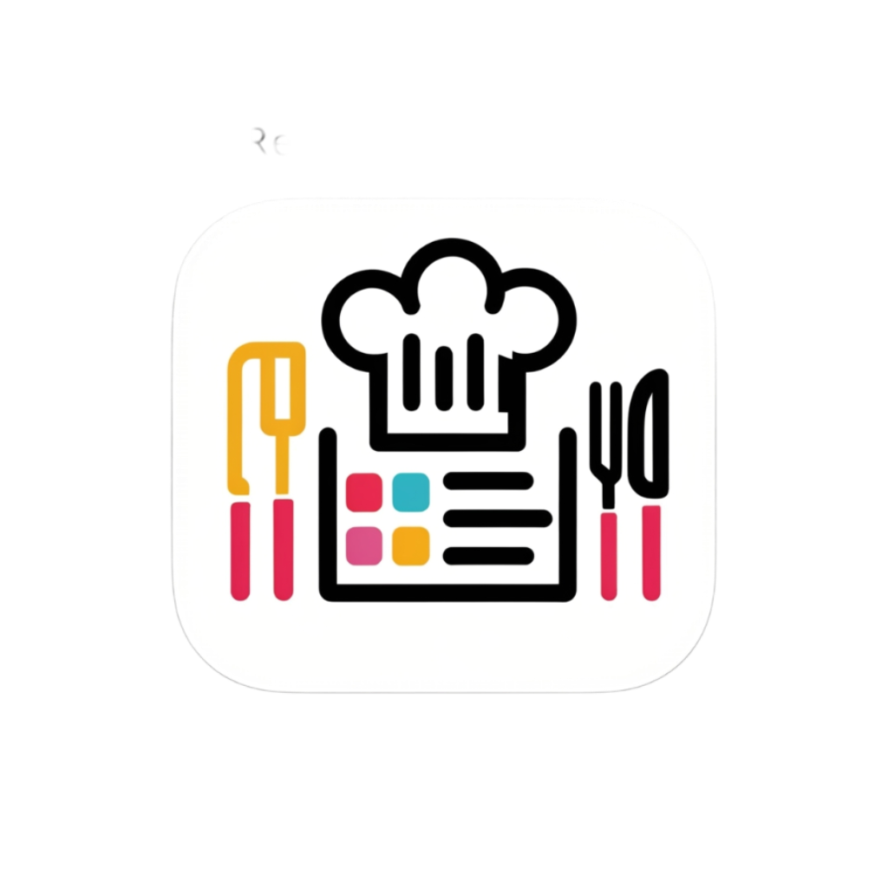
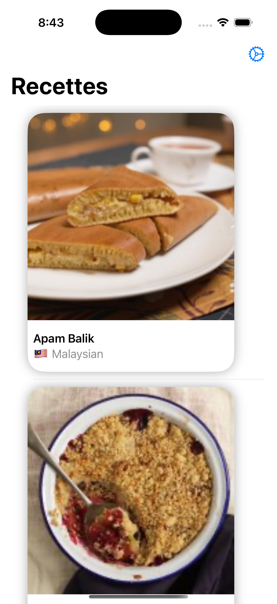

#  La Recette

<!-- PROJECT LOGO -->
 

  

  <h3 align="center">La Recette</h3>

  

    App to List Recipes
     
     
    <a href="https://github.com/TensaiSolutions/LaRecette/issues">Report Bug</a>
    ·
    <a href="https://github.com/TensaiSolutions/LaRecette/issues">Request Feature</a>
  

### Summary: Include screen shots or a video of your app highlighting its features

<video width="320" height="240" controls>
  <source src="demo.mp4" type="video/mp4">
</video>

### Focus Areas: What specific areas of the project did you prioritize? Why did you choose to focus on these areas?
I focused on Dependcy Injection of the Services to allow them to be testable and flexible. this allows me to make seperate constructions of the services for different functions as the app grows and also ensures that dependecies are being explicity used v. a global object that has all dependencies and they are shared across the app
I also worked on making sure that the Network load is as lightweight as possible by using Caching for the images and also SwiftData to hold onto the returned list of recipes unless the user requests a refresh. In a single view app this feature is less apparent but as additional functions and views are built not having to retrieve data multiple times will improve performance and lower network overhead.
I also wanted to try out using SwiftData to allow for persistance of the responses from the services. This was new for me but I wanted to see if it could be adapted for use in this app.

### Time Spent: Approximately how long did you spend working on this project? How did you allocate your time?
I spent approximately 15 hours developing the app. I spent most of this time on the plubming and features below the UI. Most time was spent on the Services and Dependency Injection framework as well as creating a cache that isn't relying on URLSession's HTTP caching.

### Trade-offs and Decisions: Did you make any significant trade-offs in your approach?
Since I needed to implement the app without using 3rd party libraries and frameworks there were some tradeoffs in terms of features within parts of the app in order to make a solid working MVP type of app. For example with DI using Protocol injection, I would normally use a framework like [swift-dependencies](https://github.com/pointfreeco/swift-dependencies). I also chose to focus on more of the below the UI layer features and requirements so the UI is still a bit rough around the edges but could be polished with some design and UX pretty easily

### Weakest Part of the Project: What do you think is the weakest part of your project?
I think the UI could use some work and breaking it up into smaller more tight Views and Components, but as noted above I chose to work more on the underlying system to make sure there was a good foundation upon which to build the app.

### Additional Information: Is there anything else we should know? Feel free to share any insights or constraints you encountered.
I really enjoyed working on this as it was a change from my daily activities and found the challenge to be a good one. There are many fetures and enhancements that could be added to make it more feature rich but overall it was a good experience.
