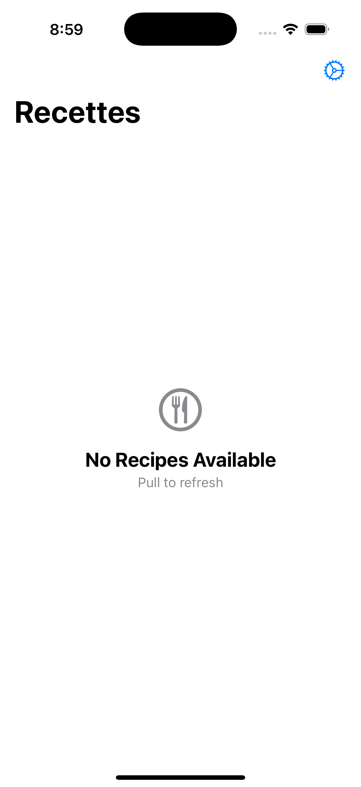
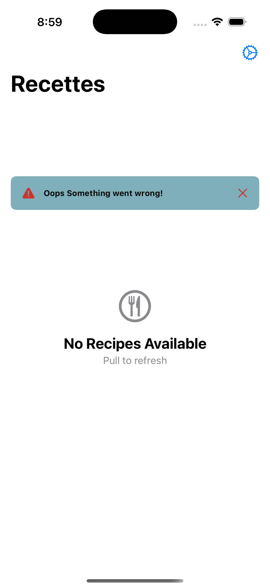

#  La Recette

<!-- PROJECT LOGO -->
 

  

  <h3 align="center">La Recette</h3>

  

    App to List Recipes
     
     
    <a href="https://github.com/TensaiSolutions/LaRecette/issues">Report Bug</a>
    ·
    <a href="https://github.com/TensaiSolutions/LaRecette/issues">Request Feature</a>
  

### Summary:
 |  |  | 
